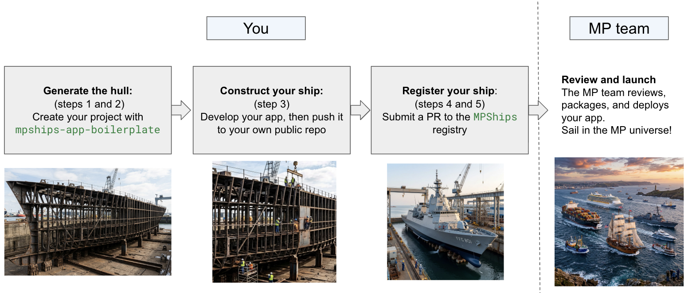

# MPShips

MPShips is the platform for [contributed Dash apps](https://next-gen.materialsproject.org/contributed-apps) on Materials Project. You write a normal Dash app by subclassing the `MPShipsApp` base class and filling in a few hooks. The MP team handles page registration, routing, and deployment.

## How it works


**You**
- Create your app by generating the hull from the template. This produces a basic app, which is a Python class that subclasses `MPShipsApp`.
- You write and test the app locally.
- You submit your app through the registry. See [Submit a PR](#5-submit-a-pr).

**MP team** (after hand-off)
- Apps are reviewed. Once approved, they are **frozen at a specific commit**.
- For production, the MP team wraps your app in an isolated Docker container.

## Quick start

### 1. Install cookiecutter

```bash
pip install cookiecutter
```

### 2. Create your app from the template

```bash
cookiecutter gh:minhsueh/mpships-app-boilerplate
```

Answer the prompts (your name, the app name, and so on). The template creates the project and sets up its virtual environment, so you don't need to install the required dependencies yourself.

If your app needs additional dependencies, install them in the virtual environment and add them to `pyproject.toml`.

### 3. Develop your app

Edit the app class the template generated, using the three `ships_` hooks described in [Anatomy of an app](#anatomy-of-an-app). The template also includes example pages you can learn from.

If your app fetches Materials Project data, set your API key first (see [Fetching Materials Project data](#fetching-materials-project-data)). Then run the app:

```bash
python run_app.py
```

Open `http://127.0.0.1:8050/`.

When it works, go through the [checklist](#checklist-before-you-submit) and push your app to its own **public** GitHub repository.

### 4. Clone the MPShips registry

You only need the registry, not the app source code that other contributors have submitted. Fork the MPShips repository on GitHub, then clone your fork with a sparse checkout:

```bash
git clone --filter=blob:none --depth 1 --sparse https://github.com/materialsproject/MPShips.git
cd MPShips
git sparse-checkout set registry
```

This downloads the latest commit and only the `registry/` folder.

Prefer not to use git locally? Open `registry/registry.yaml` on [GitHub](https://github.com/materialsproject/MPShips/blob/mpships2/registry/registry.yaml) and use the pencil icon to edit it in the browser. GitHub creates the fork and the pull request for you.

### 5. Submit a PR

In your app's repository, get the full commit SHA of the version you want reviewed:

```bash
git rev-parse HEAD
```

Then, in your clone of the registry, add an entry to `registry/registry.yaml`:

```yaml
- name: my-app
  upstream_repo: https://github.com/<you>/my-app
  upstream_commit: <full 40-character commit SHA>
  version: "1.0.0"
  author: <your-github-username>
  release_date: 2026-10-01
  description: One-line description of what your app does.
```

Commit, push, and open a pull request against the MPShips repository:

```bash
git switch -c add-my-app
git commit -am "Add my-app"
git push -u origin add-my-app
```

## Anatomy of an app

```python
from dash import html
from mpships_infra import MPShipsApp


class MyApp(MPShipsApp):
    # Optional: runs once at startup. Set instance state here.
    def ships_setup(self, *args, **kwargs):
        pass

    # Required: returns the layout for your app.
    def ships_layout(self):
        return html.Div("Hello from MyApp")

    # Optional: register your callbacks here.
    def ships_callbacks(self, app, cache):
        pass
```

### The three hooks

| Hook | Required? | When it runs | Purpose |
|---|---|---|---|
| `ships_setup(self)` | No | Once, when the app is created | Set up instance state (`self.my_value = ...`) |
| `ships_layout(self)` | **Yes** | Whenever the page renders | Return your Dash layout |
| `ships_callbacks(self, app, cache)` | No | Once, after the app layout exists | Register callbacks with `@app.callback` |

Values you set in `ships_setup` are available as `self.<name>` in `ships_layout` and `ships_callbacks`. Treat them as **read-only** (constants, configuration, data loaded once).

Don't change `self` attributes from inside a callback. One running app serves many users, so that state would be shared between all of them. Keep per-user state in a `dcc.Store` (or pass it through callback inputs and outputs), as is standard Dash practice.

If you don't need `ships_setup` or `ships_callbacks`, delete them. Neither requires a `super()` call.

If `ships_layout` is missing, Python refuses to create your class and raises a `TypeError` at load time.

### What not to override

Do not override `__init__`, `get_layout`, or `generate_callbacks`. MPShips needs these to wire up your app. Use the three hooks above instead.

### Reserved attribute names

`MPShipsApp` defines these as read-only properties. **Do not assign to them** (for example `self.name = "..."` raises an `AttributeError`):

`name`, `description`, `long_description`, `url`, `author`, `category`, `credits`, `icon`, `dois`, `docs_url`, `external_links`, `contributed`, `contributed_app`

`name` is your **class name**. It is what appears in the navigation menu, so choose the class name carefully. For your own labels, use a different attribute name, such as `self.display_label`.

## Example: an interactive layout

```python
from dash import dcc, html, Input, Output
from mpships_infra import MPShipsApp


class AlignmentDemo(MPShipsApp):
    def ships_layout(self):
        return html.Div(
            [
                html.H1("Alignment demo"),
                html.H4(f"My name is {self.name}", id="name-div"),
                dcc.Dropdown(
                    id="name-align-dropdown",
                    options=[
                        {"label": "Left", "value": "left"},
                        {"label": "Center", "value": "center"},
                        {"label": "Right", "value": "right"},
                    ],
                    value="center",
                    clearable=False,
                    style={"width": "200px", "margin": "0 auto"},
                ),
            ],
            style={"textAlign": "center"},
        )

    def ships_callbacks(self, app, cache):
        @app.callback(
            Output("name-div", "style"),
            Input("name-align-dropdown", "value"),
        )
        def update_name_alignment(align_value):
            return {"textAlign": align_value}
```

## Fetching Materials Project data

Use `get_rester()` instead of creating your own `MPRester`.

### Setup

Set your Materials Project API key as an environment variable before running your app locally:

```bash
export MP_API_KEY=<YOUR_API_KEY>
```

You can find your key on your Materials Project account (see the [API getting-started guide](https://docs.materialsproject.org/downloading-data/using-the-api/getting-started)).

### Usage

```python
from mpships_infra import get_rester

docs = get_rester().materials.summary.search(
    chemsys=["Au"], fields=["material_id", "has_props"]
)
```

```python
from mpships_infra import get_rester

contribs_docs = mpr.contribs.query_contributions(
    query={
        "project": "<YOUR_PROJECT>",
    }
)
```

See the [API documentation](https://docs.materialsproject.org/downloading-data/using-the-api/getting-started) for available endpoints.

## Links, assets, and paths

When deployed, your app is served from a different base path than on your machine. Dash adjusts for this automatically everywhere **except in URLs you write by hand**.

**Rule: never hardcode absolute paths in links, images, or iframes.**

```python
import dash
from dash import html

# Wrong: works locally, breaks once deployed
html.A("Results", href="/results")
html.Img(src="/assets/logo.png")

# Right: works in both
html.A("Results", href=dash.get_relative_path("/results"))
html.Img(src=dash.get_asset_url("logo.png"))
```

Call these inside your hooks (for example in `ships_layout`), not at module import time.

If a callback compares the browser's `pathname` (from `dcc.Location`), wrap it with `dash.strip_relative_path(pathname)` first so the comparison behaves the same locally and once deployed.

Custom CSS and JS belong in your `assets/` folder, where Dash loads them automatically. For external resources, use full URLs (`https://...`).

## Submitting your app

1. Make sure your app lives in its own public repository and follows the checklist below.
2. Open a pull request that adds an entry to `registry.yaml` in the MPShips repository:

```yaml
- name: my-app
  upstream_repo: https://github.com/<you>/my-app
  upstream_commit: <full 40-character commit SHA>
  version: "1.0.0"
  author: <your-github-username>
  release_date: 2026-10-01
  description: One-line description of what your app does.
```

3. A maintainer reviews the code at that exact commit.
4. Once approved, the MP team packages your app in an isolated Docker container and deploys it.

The reviewed commit is what runs. Later pushes to your repository do **not** change the live app.

### Updating your app

Open a new pull request that updates `upstream_commit` (and `version`) to the new commit. Each update is reviewed the same way as the first submission.

If your app needs a compatibility fix (for example, after a Materials Project API change), the MP team may apply it and will record your repository as the original source.

## Checklist before you submit

- [ ] The class subclasses `MPShipsApp` and implements `ships_layout`
- [ ] No overrides of `__init__`, `get_layout`, or `generate_callbacks`
- [ ] No assignments to reserved attributes (`name`, `description`, and so on)
- [ ] No hardcoded absolute paths in links, images, or iframes
- [ ] Data is fetched through `get_rester()`
- [ ] Dependencies are pinned (a `requirements.txt` with exact versions, or a lockfile)
- [ ] No large blob files in the repository (datasets, model weights, videos, compiled binaries). If your app needs one, talk to the MP team first
- [ ] The app runs locally with `python run_app.py`
- [ ] The registry entry uses a full commit SHA, not a branch name